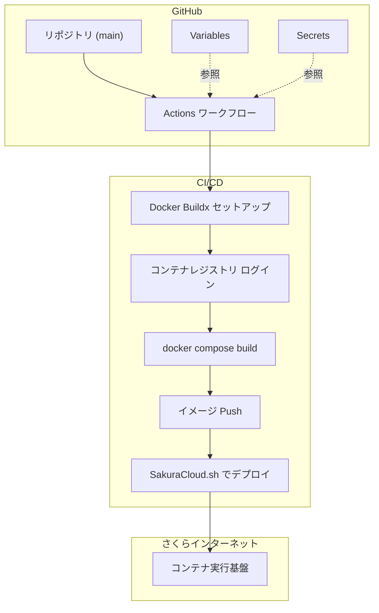

# デプロイ・構築ガイド

SendGrid Webhook to Parquet Logger のデプロイおよび構築に関するドキュメントです。

## 目次

- [設定方法](#設定方法)
- [セットアップ](#セットアップ)
- [SendGrid側の設定](#sendgrid側の設定)
- [Slack 通知](#slack-通知)
- [GitHub Actions による自動デプロイ](#github-actions-による自動デプロイ)

## 設定方法

ASP.NET Core のOptions パターンを使用して設定を管理します。

### 環境変数での設定

| 環境変数名 | 説明 | 例 |
|----------|------|-----|
| S3__ACCESSKEY | S3アクセスキー | your-access-key |
| S3__SECRETKEY | S3シークレットキー | your-secret-key |
| S3__SERVICEURL | S3エンドポイントURL | https://s3.amazonaws.com |
| S3__REGION | S3リージョン | us-east-1 |
| S3__BUCKETNAME | バケット名 | sendgrid-events |
| SENDGRID__VERIFICATIONKEY | SendGrid Event Webhook 検証用公開鍵 (PEM または Base64(SPKI)) | -----BEGIN PUBLIC KEY----- ... |
| SENDGRID__MAXBODYBYTES | Webhook リクエストボディ上限 (バイト) | 1048576 |
| SENDGRID__ALLOWEDSKEW | タイムスタンプ許容スキュー (TimeSpan.Parse 形式) | 00:05:00 |
| SENDGRID__APIKEY | SendGrid API キー (Viewer でのテンプレート取得用) | SG.xxxxxx... |
| OTEL_EXPORTER_OTLP_ENDPOINT | OpenTelemetry OTLP エンドポイントURL | http://localhost:4318 |
| OTEL_EXPORTER_OTLP_PROTOCOL | OTLP プロトコル (`grpc`/`http/protobuf`) | http/protobuf |
| OTEL_EXPORTER_OTLP_HEADERS | OTLP 追加ヘッダー（`k=v,k2=v2` 形式） | x-api-key=xxxxx |
| SLACKNOTIFIER__WARNINGWEBHOOKURL | 警告通知用 Slack Incoming Webhook URL（任意） | https://hooks.slack.com/services/T000/B000/XXX |
| SLACKNOTIFIER__INFORMATIONWEBHOOKURL | 情報通知用 Slack Incoming Webhook URL（任意） | https://hooks.slack.com/services/T000/B000/YYY |

補足: `.NET Aspire` のローカル開発時は `DOTNET_DASHBOARD_OTLP_ENDPOINT_URL`（ダッシュボードの OTLP URL）が設定される場合があり、`OTEL_EXPORTER_OTLP_ENDPOINT` が未設定でも自動的にそれを利用してメトリクス/トレース/ログを送信します。いずれの接続先情報も未設定の場合は OpenTelemetry の「送信」は行われません（計測は有効）。

### appsettings.json での設定

```json
{
  "S3": {
    "ACCESSKEY": "your-access-key",
    "SECRETKEY": "your-secret-key",
    "SERVICEURL": "https://your-s3-endpoint.com",
    "REGION": "s3-region",
    "BUCKETNAME": "sendgrid-events"
  }
}
```

環境変数は `appsettings.json` の設定を上書きします。

#### 追加オプションの詳細

- `SENDGRID__MAXBODYBYTES`: デフォルトは 1 MiB (1,048,576)。範囲は 1〜100 MiB。
- `SENDGRID__ALLOWEDSKEW`: デフォルトは `00:05:00`（5 分）。`.NET TimeSpan.Parse` 形式で指定（例: `00:00:30`, `01:00:00`, `1.00:00:00`）。

## セットアップ

### リポジトリのクローン

```bash
git clone <repository-url>
cd SendgridParquetLog
```

### DuckDbBundle ファイルの生成

```bash
(cd DuckDbBundle; npm run build)
または
(cd DuckDbBundle; npm run build:dev) # .map ファイルを生成する
```

### Dockerイメージのビルドと実行

[Docker Compose V2](https://docs.docker.jp/compose/)

[Ubuntu 用 Docker CE の入手](https://docs.docker.jp/engine/install/linux/docker-ce/ubuntu.html)
に従って docker engine をインストール

```bash
sudo apt-get install docker-compose-plugin
＃ Docker コマンドを sudo なしで実行できるようにする場合
sudo usermod -aG docker $USER
```

```bash
# イメージをビルド
docker compose build

# コンテナを起動
docker compose up -d

# ログを確認
docker compose logs -f
```

## SendGrid側の設定

1. SendGridダッシュボードにログイン
2. Settings > Mail Settings > Event Webhookに移動
3. HTTP Post URLに以下を設定:
   ```
   https://your-domain.com/webhook/sendgrid
   ```
4. 必要なイベントタイプを選択
5. 設定を保存

### 署名検証（公開鍵の形式）

本番環境では、SendGrid の Event Webhook 署名検証を必ず有効にしてください。

- 公開鍵は SPKI 形式を想定しています。以下のいずれかで指定可能:
  - PEM: `-----BEGIN PUBLIC KEY----- ... -----END PUBLIC KEY-----`
  - Base64 (PEM の中身のみを Base64 にした文字列)
- 環境変数: `SENDGRID__VERIFICATIONKEY`

開発時の簡易確認（署名検証バイパス）やローカルでの署名付きリクエスト例については [開発・デバッグガイド](./Development.md) を参照してください。

## Slack 通知

`SendgridParquetViewer` は毎日の Compaction 実行 (`CompactionStartupHostedService.Run()`) のたびに、運用者向けの通知を Slack Incoming Webhook へ送信できます。コンテナ起動時の初回 `Run()` と、JST 6 時の毎日スケジュール時に評価されます。

通知は以下の 2 系統に分かれます:

| 種別 | 環境変数 | 送信タイミング |
|---|---|---|
| 警告 (warning) | `SLACKNOTIFIER__WARNINGWEBHOOKURL` | 下記の警告条件のいずれかが成立した場合 |
| 情報 (information) | `SLACKNOTIFIER__INFORMATIONWEBHOOKURL` | 警告条件が 1 つも成立しなかった場合（正常実行、または分散ロック未取得等によりスキップされた場合） |

情報通知は以下のいずれかのバリエーションで送信されます:

- `✅ Daily Compaction 正常実行 ...` — 実際に Compaction が走り完了した
- `⏭️ Compaction スキップ: <理由> ...` — `StartCompactionAsync` が `StartTask == null` を返した場合（例: 別インスタンスが実行中で分散ロックを取得できなかった等）。毎日の Compaction 自体は「動いている」状態の範囲内なので警告ではなく情報として扱う。

### 警告条件（`Run()` 開始時に判定）

1. **Webhook 受信停止の疑い (AND 条件)** — 以下の 3 つが同時に成立した場合のみ 1 件の警告を出す。いずれか単独では警告しない。
   - JST で 2 日前の圧縮済みデータ (`v3compaction/YYYY/MM/DD/`) が**存在する** (= 直近の Compaction パイプラインは動作していた)
   - JST で 1 日前の生データ (`v3raw/YYYY/MM/DD/`) が**存在しない**
   - JST で 1 日前の圧縮済みデータ (`v3compaction/YYYY/MM/DD/`) が**存在しない**

   すなわち「Compaction パイプラインは動いているのに 1 日前のデータ (生/圧縮済みのいずれ) も無い」状態のみを Webhook 受信停止の強い疑いとして通知する。
2. **Compaction 実行自体が例外で失敗** — 既存ログ (`ZLogError`) に加えて Slack 警告にも乗せる

### URL の妥当性

両環境変数は内部的に `Uri.TryCreate(value, UriKind.Absolute, out _)` で評価され、絶対 URI かつスキームが `http` / `https` の場合のみ送信対象になります。未設定または不正な URL の場合、その種別の通知のみが黙ってスキップされ、もう一方の URL の通知やアプリケーション本体の動作には影響しません。

### Slack 側の準備

Slack ワークスペースで [Incoming Webhook アプリ](https://api.slack.com/messaging/webhooks) を追加し、警告用と情報用にそれぞれ別チャンネル（または同じチャンネル）の Webhook URL を発行して上記環境変数に設定してください。送信ペイロードは `{ "text": "..." }` 形式です。

> **重要**: Slack Incoming Webhook URL は URL 自体が対象チャンネルへの投稿権限を持つ実質的なシークレットです。リポジトリにコミットしたり、GitHub の Repository Variables に平文で入れたりせず、必ず Repository Secrets（または同等の機密管理機構）に格納してください。本リポジトリのワークフロー (`.github/workflows/deploy.yml`) も `${{ secrets.SLACKNOTIFIER__WARNINGWEBHOOKURL }}` / `${{ secrets.SLACKNOTIFIER__INFORMATIONWEBHOOKURL }}` で Secrets から読み込む構成にしています。

## GitHub Actions による自動デプロイ

このプロジェクトは GitHub Actions を使用して自動的にビルドとデプロイを行います。

<a id="gha-flow"></a>
### 図解



### 必要な設定

#### 1. Repository Variables の設定

GitHub リポジトリの Settings > Secrets and variables > Actions > Variables タブで以下の変数を設定:

| 変数名 | 説明 | 例 |
|--------|------|-----|
| CONTAINER_REGISTRY_URL | コンテナレジストリのURL | registry.example.com |
| CONTAINER_REGISTRY_USERNAME | レジストリのユーザー名 | your-username |
| SAKURACLOUD_ACCESS_TOKEN | さくらのクラウドAPIトークン | your-access-token |

S3設定に関する Repository Variables も設定してください:

| 変数名 | 説明 | 例 |
|--------|------|-----|
| S3__SERVICEURL | S3互換ストレージのエンドポイントURL | https://s3.amazonaws.com |
| S3__REGION | S3リージョン | us-east-1 |
| S3__ACCESSKEY | S3互換ストレージのアクセスキー | your-access-key |
| S3__BUCKETNAME | データを保存するS3バケット名 | sendgrid-events |

SendGrid Webhook に関する Repository Variables も任意で設定できます:

| 変数名 | 説明 | 例 |
|--------|------|-----|
| SENDGRID__MAXBODYBYTES | Webhook リクエストボディ上限 (バイト) | 1048576 |
| SENDGRID__ALLOWEDSKEW | タイムスタンプ許容スキュー (`TimeSpan.Parse` 形式) | 00:05:00 |

#### 2. Repository Secrets の設定

GitHub リポジトリの Settings > Secrets and variables > Actions > Secrets タブで以下のシークレットを設定:

| シークレット名 | 説明 |
|---------------|------|
| CONTAINER_REGISTRY_PASSWORD | レジストリのパスワード |
| SAKURACLOUD_ACCESS_TOKEN_SECRET | さくらのクラウドAPIシークレット |
| S3__SECRETKEY | S3互換ストレージのシークレットキー |
| SENDGRID__VERIFICATIONKEY | SendGrid Event Webhook 検証用公開鍵 (PEM または Base64(SPKI)) |
| SENDGRID__APIKEY | SendGrid API キー (Viewer でのテンプレート取得用、Dynamic Template 読取権限が必要) |
| SLACKNOTIFIER__WARNINGWEBHOOKURL | 警告通知用 Slack Incoming Webhook URL（任意）。実質的に対象チャンネルへの投稿権限を持つため必ず Secrets に登録し、Variables には置かないこと。 |
| SLACKNOTIFIER__INFORMATIONWEBHOOKURL | 情報通知用 Slack Incoming Webhook URL（任意）。同上。 |

### 設定手順

1. **GitHub リポジトリの設定画面を開く**
   - リポジトリのページで「Settings」タブをクリック

2. **Variables の設定**
   - 左サイドバーの「Secrets and variables」→「Actions」をクリック
   - 「Variables」タブを選択
   - 「New repository variable」ボタンをクリック
   - 各変数を追加:
     - `CONTAINER_REGISTRY_URL`: コンテナレジストリのURL
     - `CONTAINER_REGISTRY_USERNAME`: レジストリのユーザー名
     - `SAKURACLOUD_ACCESS_TOKEN`: さくらのクラウドAPIトークン
     - `S3__SERVICEURL`: S3互換ストレージのエンドポイントURL
     - `S3__REGION`: S3リージョン
     - `S3__ACCESSKEY`: S3互換ストレージのアクセスキー
     - `S3__BUCKETNAME`: データを保存するS3バケット名

3. **Secrets の設定**
   - 「Secrets」タブを選択
   - 「New repository secret」ボタンをクリック
 - 各シークレットを追加:
     - `CONTAINER_REGISTRY_PASSWORD`: レジストリのパスワード
     - `SAKURACLOUD_ACCESS_TOKEN_SECRET`: さくらのクラウドAPIシークレット
     - `S3__SECRETKEY`: S3互換ストレージのシークレットキー
     - `SENDGRID__VERIFICATIONKEY`: SendGrid Event Webhook 検証用公開鍵 (PEM または Base64(SPKI))
     - `SENDGRID__APIKEY`: SendGrid API キー (Viewer でのテンプレート取得用)
     - `SLACKNOTIFIER__WARNINGWEBHOOKURL`: 警告通知用 Slack Incoming Webhook URL (任意、投稿権限を持つため必ず Secrets)
     - `SLACKNOTIFIER__INFORMATIONWEBHOOKURL`: 情報通知用 Slack Incoming Webhook URL (任意、投稿権限を持つため必ず Secrets)

### ワークフローのトリガー

GitHub Actions ワークフローは以下の条件でトリガーされます:

- `main` ブランチへのプッシュ時
- 手動実行（Actions タブから「Run workflow」ボタンをクリック）

### ワークフローの動作

1. リポジトリのコードをチェックアウト
2. Docker Buildx をセットアップ
3. コンテナレジストリにログイン
4. `docker compose build` でイメージをビルド
5. ビルドしたイメージをレジストリにプッシュ
6. `SakuraCloud.sh` スクリプトを実行してさくらのクラウドにデプロイ

### デプロイの確認

GitHub Actions の実行状況は以下で確認できます:

1. リポジトリの「Actions」タブをクリック
2. 実行中または完了したワークフローを選択
3. 各ステップの詳細ログを確認

エラーが発生した場合は、ログを確認して必要な設定や権限を見直してください。
