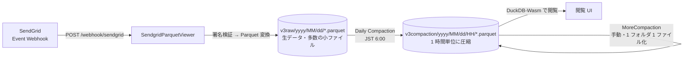
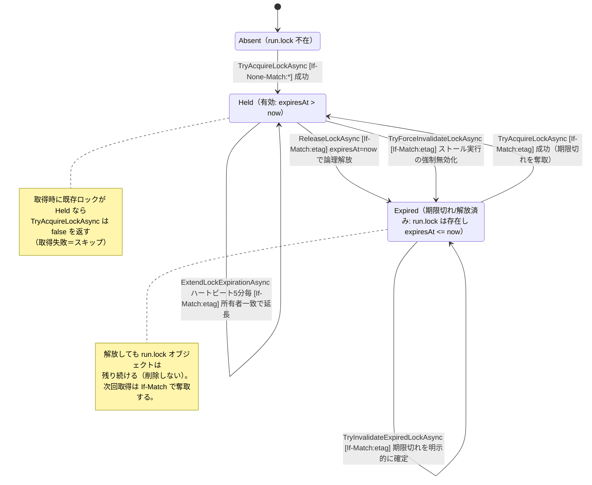

# 実装ガイド (Implement)

SendGrid Event Webhook を受信し Parquet として S3 互換ストレージへ蓄積・圧縮する本システムの、現在の実装内容をまとめたドキュメントです。運用・デプロイ手順は [Deployment.md](./Deployment.md)、ローカル開発・デバッグは [Development.md](./Development.md) を参照してください。

## 目次

- [システム全体像](#システム全体像)
- [アーキテクチャの変遷](#アーキテクチャの変遷)
- [プロジェクト構成](#プロジェクト構成)
- [データフローと S3 レイアウト](#データフローと-s3-レイアウト)
- [Webhook 受信と Parquet 書き込み](#webhook-受信と-parquet-書き込み)
- [Compaction（定期圧縮）](#compaction定期圧縮)
- [Compaction のメモリ使用特性](#compaction-のメモリ使用特性)
- [MoreCompaction（追加コンパクション）](#morecompaction追加コンパクション)
- [S3 を用いたロック機構](#s3-を用いたロック機構)
- [既知の課題・改善予定](#既知の課題改善予定)

## システム全体像

本システムは SendGrid の Event Webhook を受け取り、イベントを Apache Parquet 形式に変換して S3 互換ストレージ（さくらのオブジェクトストレージ等）へ保存します。蓄積された多数の小さな Parquet ファイルは、1 日ごとに時間単位へ圧縮（Compaction）され、閲覧・分析は DuckDB(-Wasm) を通じて行われます。

主なコンポーネントは以下の 2 つです。

- **SendgridParquetViewer** — 現在の本番稼働アプリケーション。Webhook 受信・Parquet 保存・Compaction・閲覧 UI（Blazor Server + Fluent UI）・認証（Azure AD / 開発用認証）をすべて担う。
- **SendgridParquetLogger** — 当初 Webhook 受信専用だったアプリケーション。現在はデプロイを停止しており、コードのみ残存（後述）。

共通処理は **SendgridParquet.Shared** に集約されています。

## アーキテクチャの変遷

### Logger のデプロイ停止（コミット `465bdbf`, #73）

当初は Webhook 受信を軽量な **SendgridParquetLogger** が担い、閲覧・圧縮は **SendgridParquetViewer** が担う 2 アプリ構成でした。Logger は受信専用で軽量なため、さくらインターネットの **256MB メモリモデル**（AppRun）で安価に運用する想定でした。

しかし、さくらインターネットのサービス提供において **256MB メモリモデルが提供されなくなり**、Logger を単独インスタンスとして常時稼働させることがコスト的に見合わなくなりました。そのため `465bdbf` にて次の対応を行いました。

- **Webhook 受信機能を SendgridParquetViewer に集約**（`SendgridParquetViewer/Controllers/WebhookController.cs` を追加、#72）。
- `.github/workflows/deploy.yml` から **Logger 側の Docker ビルド / プッシュ / AppRun デプロイステップを削除**し、`APP_NAME_SENDGRID_LOGGER` env も除去。
- Logger 用の Sakura Cloud AppRun インスタンスを廃止。

その結果、現在は **SendgridParquetViewer 1 アプリ**が Webhook 受信から圧縮・閲覧までを一手に引き受けています。Logger のコード（[SendgridParquetLogger/Program.cs](../SendgridParquetLogger/Program.cs) 等）は AOT 対応の受信専用実装としてリポジトリに残っていますが、CI からデプロイされることはありません。

> Viewer 単独運用に伴い、以前は Logger が担っていた「起動時の S3 バケット存在保証」も Viewer 側で行うようになっています（`CreateBucketService` を Viewer に登録。[Program.cs](../SendgridParquetViewer/Program.cs) 参照）。

## プロジェクト構成

| プロジェクト | 役割 | 稼働状況 |
|---|---|---|
| `SendgridParquetViewer` | Webhook 受信 / Parquet 保存 / Compaction / 閲覧 UI / 認証 | **本番稼働** |
| `SendgridParquetLogger` | Webhook 受信専用（AOT 対応の軽量実装） | コードのみ残存・デプロイ停止 |
| `SendgridParquet.Shared` | S3 アクセス、AWS 署名 v4、Parquet 変換、Webhook 共通処理、パス生成 | 共通ライブラリ |
| `SendgridParquetLog.AppHost` | .NET Aspire のローカル開発用オーケストレーション | 開発用 |
| `SendgridParquetLog.ServiceDefaults` | OpenTelemetry / ヘルスチェック等の共通設定 | 共通 |
| `SendgridParquetLogger.Test` | 署名検証等のテスト | テスト |
| `DuckDbBundle` / `duckdb-wasm-vite` | 閲覧 UI 用の DuckDB-Wasm バンドル | フロント資産 |

### 共通ライブラリ（SendgridParquet.Shared）の主なクラス

- **`S3StorageService`** — S3 互換ストレージへの HTTP アクセス。AWS Signature V4 の署名を自前実装し、`PutObject` / `GetObject` / `ListObjectsV2`（継続トークン対応）/ `DeleteObject` / HEAD による存在確認、そして**条件付き PUT**（`If-None-Match: *` / `If-Match: <etag>`）を提供する。ロック機構の中核はこの条件付き PUT。
- **`WebhookHelper`** — Webhook ボディの読み取り（上限バイト制御）、署名検証、JSON デシリアライズ、日付単位での Parquet 書き込みまでを行う共通処理。Logger / Viewer の両コントローラから利用される。
- **`RequestValidator`** — SendGrid の Event Webhook 署名（ECDSA / SPKI 公開鍵）を検証。
- **`ParquetService`** — `SendGridEvent` 配列 ⇔ Parquet の相互変換（ストリーミング書き込み対応）。
- **`SendGridPathUtility`** — S3 上のキー・プレフィックス・ファイル名生成を一元管理（後述のレイアウトを定義）。
- **`CreateBucketService`** — 起動時にバケットが無ければ作成する `IHostedService`。

## データフローと S3 レイアウト



S3 上のキー体系は [SendGridPathUtility](../SendgridParquet.Shared/SendGridPathUtility.cs) で定義されます。列定義のバージョンに合わせて `v3` プレフィックスが付いています。

| 種別 | キー例 | 説明 |
|---|---|---|
| 生データ | `v3raw/2026/07/01/<sha256>.parquet` | Webhook 受信ごとに書かれる小さな Parquet。ファイル名は内容の SHA-256（再送時に同名で上書きされ冪等）。 |
| 圧縮済み | `v3compaction/2026/07/01/13/<sha256>.parquet` | Compaction が 1 時間単位でまとめた Parquet。 |
| 実行状態 | `v3compaction/run.json` | 直近 Compaction の進捗・結果（`RunStatus`）。 |
| ロック | `v3compaction/run.lock` | 分散ロックの本体（`LockInfo` を JSON 格納）。 |
| 追加圧縮出力 | `v3compaction/2026/07/01/13/morecompaction2026070113.parquet` | MoreCompaction がフォルダを 1 ファイルへ統合した出力。 |
| 追加圧縮マーカー | `v3compaction/2026/07/morecompaction.json` | その年月の全フォルダが 1 parquet 保証済みであることを示す完了マーカー。 |

## Webhook 受信と Parquet 書き込み

エンドポイントは `POST /webhook/sendgrid`（`[AllowAnonymous]` + `[IgnoreAntiforgeryToken]`。[WebhookController](../SendgridParquetViewer/Controllers/WebhookController.cs)）。処理本体は共通の `WebhookHelper.ProcessReceiveSendGridEventsAsync` です。

1. ボディを `PipeReader` から読み取り（`SENDGRID__MAXBODYBYTES` を超えると `400`）。
2. `RequestValidator` で署名を検証（未検証は `400`）。
3. JSON を `SendGridEvent[]` にデシリアライズ。
4. イベントを **JST の日付単位**でグルーピングし、日付ごとに Parquet へ変換。
5. ファイル名は Parquet 内容の SHA-256 から生成（`GetParquetNonCompactionFileName`）。同一内容の再送は同名キーになり上書きされるため、書き込み途中失敗後の再送に対して冪等。
6. `v3raw/yyyy/MM/dd/` 配下へ PUT。

Webhook は最大でも ~768KB 程度で届く前提のため、変換はメモリ上（`MemoryStream`）で行っています。

## Compaction（定期圧縮）

`v3raw` の多数の小ファイルを、`v3compaction/yyyy/MM/dd/HH` 配下の**1 時間 1 ファイル**を目標に圧縮する処理です。[CompactionStartupHostedService](../SendgridParquetViewer/Services/CompactionStartupHostedService.cs) が `BackgroundService` として駆動し、実体は [CompactionService](../SendgridParquetViewer/Services/CompactionService.cs) が担います。

### スケジュールと起動

- コンテナ起動直後に 1 回、以降は **JST 毎日 6:00** に実行。
- 各実行前に **jitter（5〜30 秒のランダム遅延）** を挟み、複数インスタンスが同時にロック確認へ殺到するのを避ける。
- `Compaction:PeriodicRunEnabled=false` で定期実行を無効化可能。

### 実行の流れ

1. `StartCompactionAsync` — プロセス内では `SemaphoreSlim` で同時 1 実行に制限。既存の `run.json` を見て、前回実行が異常終了・ストール（`run.json` が古い、またはロックが期限切れ／不在）していれば `FinalizeStalledRunAsync` で強制終了扱いにしてロックを解放する。
2. **分散ロックを取得**（`TryAcquireLockAsync`）。取れなければスキップ理由を返す（後述の Slack「情報」通知になる）。
3. 対象日（既定は JST で昨日以前。`Compaction:TargetBefore`）を列挙し、`run.json` に初期状態を保存。
4. 別 `Task` で `ExecuteCompactionAsync` を開始。日ごと・バッチごとに `v3raw` を読み、時間単位で束ねて `v3compaction` へ書き出す。
   - 1 バッチの読み込み上限は `Compaction:MaxBatchSizeBytes`（既定 512MB）。RowGroup サイズは 60,000 行。
   - 出力後に Parquet として再読込できるか **Verify** し、成功して初めて元の生ファイルを削除（検証失敗時は出力側を削除して元を残す）。
5. 実行中は**ロックのハートビート**（`LockDuration/6 = 5 分`ごとに延長）を並行して回す。ハートビートが連続 3 回失敗するとコンパクションをキャンセルし、二重実行を防ぐ。
6. 完了時（キャンセル含む）にロックを解放し、`run.json` に終了状態を保存。

### 健全性チェックと Slack 通知

各 `Run()` の冒頭で [CompactionHealthCheck](../SendgridParquetViewer/Services/CompactionHealthCheck.cs) を実行し、以下の **AND 条件**が成立したときだけ「Webhook 受信停止の疑い」を 1 件警告します。

- 2 日前（JST）の `v3compaction` が**存在する**（＝直近まで圧縮パイプラインは動いていた）
- 1 日前（JST）の `v3raw` が**存在しない**
- 1 日前（JST）の `v3compaction` が**存在しない**

警告があれば Slack の警告 Webhook へ、なければ情報 Webhook へ通知します（正常実行 / スキップ）。詳細な条件・環境変数は [Deployment.md の「Slack 通知」](./Deployment.md#slack-通知) を参照。

## Compaction のメモリ使用特性

### 観測されている現象

ブラウザの `/compaction` 画面から **Start Compaction** を実行すると、コンテナのメモリ使用率が次の **2 段階**で推移して OOM に至ります。

1. **40% → 75% 付近: 緩やかな右肩上がり**（実行時間にほぼ比例）。
2. **75% → 100%: 急スパイク**。短時間で一気に上限へ到達し、メモリ不足でコンテナが再起動する。

問題の本質は 2 の**急スパイク**側にあります。緩やかな上昇（1）だけであれば上限手前で頭打ちする可能性もありますが、実際には**終盤に一括で大量のメモリを確保する経路**があり、そこで一気に上限を超えていると考えられます。以下ではこの**スパイク経路**を中心に記述します。

> 画面からの手動実行と JST 6:00 の定期実行は同じ `StartCompactionAsync` を通る同一処理です。したがって本現象は「ブラウザ実行に固有」というより、**Compaction 処理そのものが長時間・大量データを扱うときのメモリ挙動**として現れます。手動実行では未処理日（バックログ）がまとめて対象になりやすく、1 回の実行が長くなるぶん顕在化しやすい傾向があります。

### メモリを消費する箇所（設計上の想定）

Compaction は基本的に**ディスク上の一時ファイルを介したストリーミング処理**として実装されており、全イベントを一度にメモリへ載せない設計です（[CompactionService](../SendgridParquetViewer/Services/CompactionService.cs)、[ParquetService](../SendgridParquet.Shared/ParquetService.cs)）。

- **ディスクに逃がしているもの**（`DisposableTempFile` は `FileOptions.DeleteOnClose`）
  - S3 からダウンロードした元 Parquet ファイル（1 本ずつ一時ファイルへ）。
  - 1 時間単位に束ねた中間データ（`raw{yyyyMMdd}_{batch}/{yyyyMMddHH}/` 配下に MemoryPack でシリアライズ）。
  - マージ出力の Parquet（一時ファイルへ書いてから S3 へアップロード）。
- **メモリ上に載るもの（一時的・原則バウンド）**
  - 読み取り時: RowGroup 1 つ分の `List<SendGridEvent>`。
  - 書き込み時: `ParquetService` の `ColumnBuffer` が **最大 `RowGroupSize`（現状 60,000 行）× 約 24 列**を保持し、閾値に達すると RowGroup として書き出して `Clear()` する。`BuildDataColumn()` の `ToArray()` で一時的に倍の確保が発生する。
  - Parquet.Net が内部で確保する列エンコード／圧縮用の**大きな `byte[]`**。

読み込み量は 1 バッチあたり `Compaction:MaxBatchSizeBytes`（既定 **512MB**）で頭打ちになり、行バッファも `RowGroupSize` で頭打ちになるため、**理屈の上ではメモリ使用量は一定範囲に収まる**はずの設計です。実際、`RowGroupSize` はもともと 200,000 行だったものを、1GB インスタンスでの OOM を受けて 60,000 行へ引き下げた経緯がコード中に残っています（`CompactionService` の `RowGroupSize` 付近のコメント）。

### 第 1 段階: 40% → 75% の緩やかな上昇（背景）

こちらは「じわじわ」であり、単独では即死には至りにくい部分です。要因は以下の複合と考えられます（背景として整理。仮説）。

- **LOH（Large Object Heap）の断片化**: Parquet の読み書きでは 85,000 バイトを超える大きな配列が多数確保され LOH に載る。LOH は既定では圧縮されないため、多数の `v3raw` ファイル・時間帯・バッチを跨いで処理を続けるほど**断片化で RSS がじわじわ増加**する。
- **サーバー GC のヒープ挙動**: ASP.NET Core は既定でサーバー GC を使い、メモリを積極的に OS へ返さない。コンテナのメモリ上限を GC が認識していないと、解放が後手に回り使用率のベースラインが上がっていく。

### 第 2 段階: 75% → 100% の急スパイク（本質・調査の中心）

急スパイクは、**1 つの RowGroup をまとめて書き出す瞬間**に発生していると強く疑われます。該当経路は次のとおりです。

```
ExecuteCompactionOneDayAsync
  └─ CompactionBatchAsync
       └─ CreateCompactedParquetAsync            … 1 時間フォルダごとに 1 出力ファイルを作る
            └─ ParquetService.ConvertToParquetStreamingAsync(rowGroupSize = 60,000)
                 └─ WriteRowGroupAsync            ★ ここで一括確保 → スパイク
```

`ConvertToParquetStreamingAsync` はイベントを 1 件ずつ 24 本の `ColumnBuffer` に貯め、**行数が `RowGroupSize`（60,000）に達した時点で `WriteRowGroupAsync` を呼んで一気に書き出します**（[ParquetService.cs](../SendgridParquet.Shared/ParquetService.cs)）。この「書き出しの瞬間」に以下が**同時にメモリ上へ載る**ため、局所的に大きな確保が発生します。

- **24 列ぶんの生データ**: `List<T>`（各最大 60,000 要素）。行グループ書き出しの入口では 24 本すべてが満杯。
- **`BuildDataColumn()` の `ToArray()`**: 各列で `List<T>` から**新しい配列へコピー**するため、その列は一時的に約 2 倍のメモリを占める。
- **Parquet.Net が保持する圧縮済みバッファ**: `WriteRowGroupAsync` は 1 列ずつ `WriteColumnAsync` → `Clear()` するが、`ParquetRowGroupWriter` は **`using` を抜けて RowGroup をフラッシュするまで、書き込んだ全列のエンコード／圧縮済みデータを保持**する。つまり列を進めるほど「生データ（減少）＋圧縮済みデータ（増加）」が積み上がり、RowGroup 完了直前に**その行グループ丸ごとに相当する量**がメモリに載る。

さらに、このスパイクは**行数だけでなく列の中身（文字列長）に強く依存**します。`response`（バウンス応答本文）・`user_agent`・`url`・`category` などは可変長文字列で、内容が大きいレコードが多い時間帯では、同じ 60,000 行でもバッファ実サイズが桁違いに膨らみます。これが「行数上限でバウンドしているはず」の想定を超え、**特定の時間帯・特定のバッチでだけ突発的に跳ねる**（＝急スパイクに見える）主因と考えられます。

スパイクを増幅する条件:

- **データの偏り**: SendGrid の送信はバースト的で、イベントが**特定の 1 時間へ集中**しやすい。1 バッチ（最大 `MaxBatchSizeBytes` = 512MB の読み込み）がほぼ 1 つの時間フォルダに落ちると、その巨大な hour folder に対する `ConvertToParquetStreamingAsync` が **RowGroup フラッシュを短時間に連続実行**し、LOH の確保が GC の回収に追いつかず一気に上限へ達する。
- **`RowGroupSize` の妥当性**: この値はもともと 200,000 行で、1GB インスタンスでの OOM を受けて 60,000 行へ引き下げた経緯がコードに残る（`CompactionService` の `RowGroupSize` コメント）。**この一括書き出しがメモリ上のクリティカルパス**であることの裏付け。
- **インスタンスのメモリプラン**: Logger 廃止（`465bdbf`）後、Compaction は Viewer 単独インスタンスで動く。ベースライン（第 1 段階）が 75% まで上がった状態で上記の一括確保が乗ると、余裕が足りず上限を突破する。

> まとめると、**緩やかな上昇（第 1 段階）でヘッドルームを削られた状態に、RowGroup 一括書き出し（第 2 段階）という同期的な大量確保が重なって上限を突破する**、という二段構えが現象の実体と考えられます。切り分け（どの時間帯・どの列でスパイクするか）と対策は改善フェーズで行います。

### メモリに影響する設定・調整ポイント

| 項目 | 現状 | スパイクへの影響 |
|---|---|---|
| **`RowGroupSize`** | 60,000 行（定数） | **スパイクの直接要因**。1 回の `WriteRowGroupAsync` で一括確保する量を決める。小さくすればスパイク高は下がるが RowGroup 数が増える。変更にはコード修正が必要。可変長文字列を考慮し「行数」ではなく「概算バイト数」で区切る方式も候補。 |
| `Compaction:MaxBatchSizeBytes` | 512MB | 1 バッチの読み込み上限。大きいほど 1 つの hour folder に大量イベントが集まりやすく、RowGroup フラッシュが連続してスパイクを誘発する。小さくすると緩和。 |
| 稼働インスタンスのメモリ | プラン依存 | ベースライン（第 1 段階）が高いとスパイクの一括確保を吸収できない。余裕のあるプランが前提。 |
| .NET GC 設定（環境変数） | 既定（サーバー GC） | `DOTNET_gcServer=0`（ワークステーション GC）、`DOTNET_GCConserveMemory`、`DOTNET_GCHeapHardLimit(Percent)` によるコンテナ上限の認識、LOH 圧縮などが緩和策の候補。GC がスパイク直前に回収できれば OOM を回避できる可能性がある。 |

> 本節は現象と現状実装の整理です。恒久的な対策（RowGroup をバイト量ベースで区切る／`RowGroupSize` 引き下げ、`MaxBatchSizeBytes` 見直し、GC 設定によるコンテナ上限の認識と LOH 圧縮、インスタンスプランの見直し等）は [既知の課題・改善予定](#既知の課題改善予定)として別途対応します。

## MoreCompaction（追加コンパクション）

通常 Compaction が途中失敗すると、`v3compaction/yyyy/MM/dd/HH` 直下に複数 Parquet が残ることがあります。[MoreCompactionService](../SendgridParquetViewer/Services/MoreCompactionService.cs) は、指定した年月（または 1 日）を走査し、**1 時間フォルダあたり複数ファイルがあるものを 1 ファイルへ統合**します。自動実行はせず、画面からの明示指示で年月スキャン／フォルダ単位実行を行います（#76）。

冪等性のため、実行時に出力キー（`morecompaction{yyyyMMddHH}.parquet`）の存在を HEAD で確認し、

- **既に出力がある**（前回のクリーンアップ途中で中断／他実行者が作成済み）→ 出力を Verify したうえで残ソースの削除のみ行う（再マージしない＝部分削除済みソースでの上書き＝データ欠損を防ぐ）。
- **出力が無い** → ストリーミングでマージ → **`If-None-Match: *` 付き条件付き PUT**（競合上書き防止）→ Verify → 元ソース削除。

年月内の全フォルダが 1 ファイル保証されたら、完了マーカー `morecompaction.json` を書き込みます。

## S3 を用いたロック機構

Compaction を複数インスタンス／複数実行から保護するための分散ロックです。専用のロックサービス（Redis 等）を持たず、**S3 オブジェクト 1 つ（`v3compaction/run.lock`）と、S3 の条件付き書き込み（ETag による CAS）だけで実現**しています。実装は [S3LockService](../SendgridParquetViewer/Services/S3LockService.cs)。

> **注意**: 本ロック機構は運用上、動作が不安定になることがあります（[既知の課題](#既知の課題改善予定)参照）。本節は現状の実装を記述するものであり、本ドキュメント作成後に改善を予定しています。

### ロックオブジェクトの内容（LockInfo）

`run.lock` には [LockInfo](../SendgridParquetViewer/Models/LockInfo.cs) が JSON で格納されます。

| フィールド | 意味 |
|---|---|
| `lockId` | 実行ごとに払い出す GUID（`RunStatus.LockId` と対応）。 |
| `ownerId` | 取得インスタンスの識別子 `{MachineName}_{Guid}`（プロセス起動時に固定）。 |
| `acquiredAt` | 取得時刻（UTC）。 |
| `expiresAt` | 有効期限（UTC）。既定の `LockDuration` は 30 分。 |
| `hostName` | 取得インスタンスのマシン名。 |

### 中核となる操作と CAS

- ロックの**取得・延長・解放・無効化**はすべて「GET でオブジェクトと **ETag** を読む → 判定 → **条件付き PUT** で書く」形を取ります。
- 条件付き PUT（[S3StorageService.PutObjectWithConditionAsync](../SendgridParquet.Shared/S3StorageService.cs)）は、
  - 期待 ETag があれば `If-Match: <etag>`（読んだ時点から変わっていなければ上書き）、
  - ETag が無ければ `If-None-Match: *`（オブジェクトが存在しなければ作成）
  を付与し、S3 側で `412 Precondition Failed` になれば失敗（＝他者が割り込んだ）として扱います。
- **ロックオブジェクトは削除しません**。「解放」は `expiresAt` を現在時刻へ更新することで**論理的に期限切れ**にすることで表現します（CAS 更新）。これにより、解放後にハートビート延長が競合してロックが復活する事故を避けています。

### 状態遷移図

ロックオブジェクトの「状態」を次の 3 つで表します。各遷移のラベルは `メソッド [条件付き PUT のヘッダー]` を示します。CAS 失敗（`412`）時は状態が変わりません。



### 取得（TryAcquireLockAsync）の判定

1. `run.lock` を GET。
2. 中身があり、デシリアライズできて `expiresAt > now` なら**他者が保持中**とみなし `false`（取得失敗）。
   - デシリアライズに失敗した場合は、壊れたロックを勝手に奪わず**取得を拒否**（手動解決を促す）。
3. それ以外（不在 or 期限切れ）は新しい `LockInfo` を作り、
   - 不在なら `If-None-Match: *`、期限切れなら読み取った ETag で `If-Match` を付けて PUT。
   - `412` なら他者が先に取得／変更したとみなし `false`。

### 延長・解放・ストール処理

- **延長（ハートビート）**: `ExtendLockExpirationAsync` は `lockId` と `ownerId` の両方が自分と一致する場合のみ `expiresAt` を更新。連続失敗が閾値（3 回）に達すると呼び出し側がコンパクションをキャンセルし、二重実行を防ぐ。
- **解放**: `ReleaseLockAsync` も所有者一致を確認してから `expiresAt=now` に CAS 更新。
- **ストール検出**: `StartCompactionAsync` は `run.json` の最終活動時刻が `MaxInactivityDuration = 1 日`を超える、または**ロックが期限切れ／不在**なら、前回実行をストールとみなし `FinalizeStalledRunAsync` で強制終了。ただしハートビートが十分に生きている（`expiresAt` が `now + LockHeartbeatInterval` より先）場合は、`run.json` が古いだけで実際は稼働中とみなしストール確定をスキップする。強制無効化は `TryForceInvalidateLockAsync`（所有者・`lockId` 一致を CAS で確認）で行う。

## 既知の課題・改善予定

### Compaction のメモリ使用量（OOM によるコンテナ再起動）

`/compaction` 実行時にメモリ使用率が **40%→75% は緩やか、その後 75%→100% は急スパイク**して OOM でコンテナが再起動する現象があります（詳細は [Compaction のメモリ使用特性](#compaction-のメモリ使用特性)）。急スパイクは **RowGroup 一括書き出し（`ParquetService.WriteRowGroupAsync`）** が最有力で、60,000 行 × 24 列の生データ＋`ToArray()` コピー＋Parquet.Net の圧縮バッファが同時に載ること、可変長文字列（`response` 等）でその実サイズが跳ねること、イベントが特定 1 時間に集中してフラッシュが連続することが重なると考えられます。恒久対策（RowGroup をバイト量ベースで区切る／`RowGroupSize`・`MaxBatchSizeBytes` の見直し、GC 設定によるコンテナ上限の認識と LOH 圧縮、稼働プランの見直し）は改善フェーズで検討します。

### S3 ロック機構の不安定性

現状のロック機構は、以下のような理由で**動作が不安定になることがあります**。本ドキュメント作成後に改善を依頼・実施する予定です。

- **S3 互換ストレージの条件付き書き込みサポート差**: `If-Match` / `If-None-Match` を用いた CAS は、S3 互換ストレージ側の対応状況やセマンティクスに依存する。実装は `412 Precondition Failed` を前提にしているが、ストレージがこれを正しく返さない／サポートしない場合、ロックの排他が崩れる恐れがある。
- **ETag の扱い**: `GetObjectWithETagAsync` は成功 GET で ETag が欠落していると例外を投げる。ストレージが weak ETag や欠落を返すケースで取得・延長・解放が失敗しうる。
- **クロックスキュー**: `expiresAt` の比較は各インスタンスの `TimeProvider`（UTC）に基づく。インスタンス間の時刻ずれが大きいと、期限切れ判定・ストール判定がぶれる。
- **GET→PUT 間のレース**: CAS で守ってはいるが、`run.json`（進捗）と `run.lock`（ロック）が別オブジェクトのため、両者の整合が一時的に崩れる状況（片方だけ更新された等）で、ストール判定・強制無効化のロジックが期待通りに働かないことがある。
- **ハートビート失敗時の挙動**: 一時的なネットワーク不調で延長に連続失敗するとコンパクションが自らキャンセルする設計のため、ストレージが不安定な環境では処理が途中終了しやすい。

> 上記は現状の設計・実装から想定される不安定要因の整理です。実際の改善方針（例: ロック専用の仕組みへの置き換え、CAS 前提の見直し、run.json と run.lock の統合や整合強化など）は改善フェーズで別途検討します。
