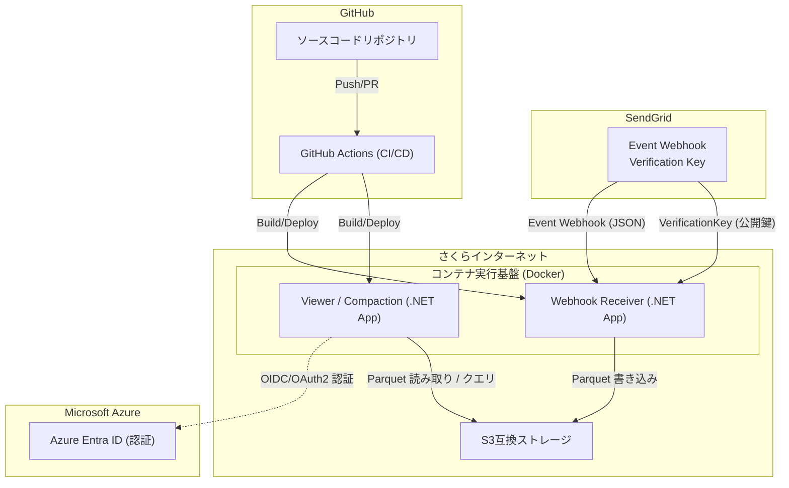

# SendGrid Webhook to Parquet Logger

SendGrid WebHookを受信してParquet形式でS3互換ストレージに保存する.NET 10.0アプリケーション

## 目次

- [概要](#概要)
- [データフロー図（サービスの役割）](#service-flow)
- [機能](#機能)
- [更新情報](#更新情報)
- [API エンドポイント](#api-エンドポイント)
- [データ形式](#データ形式)
- [DuckDBでの使用例](#duckdbでの使用例)
- [ドキュメント](#ドキュメント)
- [ライセンス](#ライセンス)
- [サポート](#サポート)

## 概要

このアプリケーションは、SendGridのEvent Webhookを受信し、イベントデータをParquet形式に変換してS3互換ストレージに保存します。保存されたデータはDuckDBなどのツールで効率的に分析できます。

<a id="service-flow"></a>
## データフロー図（サービスの役割）



## 機能

- SendGrid Event Webhookの受信 (POST /webhook/sendgrid)
- Parquet形式への変換 (DuckDB互換)
- S3互換ストレージへの保存
- 自動的なディレクトリ構造での保存 (年/月/日)
- ヘルスチェックエンドポイント (GET /health6QQl)
- Docker対応 (linux/amd64)

補足: 保存されるタイムスタンプは UTC の Unix 秒です。一方で保存先のディレクトリ構造は JST(UTC+9) の日単位でグルーピングされます。

## 更新情報

- 2025-09-13: コンパクション実行時の対象ファイル取得を見直し、S3 の ListObjectsV2 によるページング処理に対応しました。これにより、対象日付配下の Parquet ファイルが1000件に制限されず「全件」処理されます（`SendgridParquet.Shared/S3StorageService.cs` の `ListFilesAsync` / `ListDirectoriesAsync` を継続トークンで全ページ走査する実装に変更）。コンパクション自体は `MaxBatchSizeBytes` に基づいて複数バッチに分割して進行します。
  - 注: Viewer のホーム画面一覧（`Components/Pages/Home.razor`）には表示パフォーマンスのため `const int limit = 1000` が残っていますが、これは画面表示のみの制限であり、コンパクション処理には影響しません。

## API エンドポイント

### Webhookイベント受信

```http
POST /webhook/sendgrid
Content-Type: application/json

[
  {
    "email": "example@example.com",
    "timestamp": 1513299569,
    "event": "delivered",
    "sg_event_id": "...",
    "sg_message_id": "..."
  }
]
```

### ヘルスチェック

```http
GET /health6QQl

Response:
{
  "status": "healthy",
  "timestamp": "2025-08-29T10:30:00Z"
}
```

## データ形式

保存されるParquetファイルには以下のカラムが含まれます:

| カラム名 | 型 | 説明 |
|---------|---|------|
| email | string | 受信者のメールアドレス |
| timestamp | long (Unix 秒) | イベント発生時刻(UTC) |
| event | string | イベントタイプ (delivered, opened, clicked等) |
| category | string | カテゴリ (JSON配列形式) |
| sg_event_id | string | SendGridイベントID |
| sg_message_id | string | SendGridメッセージID |
| smtp_id | string | SMTP ID |
| useragent | string | ユーザーエージェント |
| ip | string | IPアドレス |
| url | string | クリックされたURL |
| reason | string | バウンス理由 |
| status | string | ステータスコード |
| response | string | SMTPレスポンス |
| tls | int? | TLS使用有無 |
| attempt | string | 送信試行回数 |
| type | string | イベントのタイプ |
| bounce_classification | string | バウンス分類 |
| asm_group_id | int? | ASMグループID |
| unique_args | string | カスタム引数 (JSON形式) |
| marketing_campaign_id | int? | マーケティングキャンペーンID |
| marketing_campaign_name | string | マーケティングキャンペーン名 |
| pool_name | string | IPプール名 |
| pool_id | int? | IPプールID |
| send_at | long? (Unix 秒) | 送信予定時刻(UTC) |

## DuckDBでの使用例

保存されたParquetファイルはDuckDBで直接クエリできます。
[DuckDBクエリ例](./SendgridParquetLogger/test-duckdb.sql) を参考にしてください。

## ドキュメント

- [デプロイ・構築ガイド](./Documents/Deployment.md) — 設定方法、セットアップ、SendGrid 側の設定、GitHub Actions による自動デプロイ
- [開発・デバッグガイド](./Documents/Development.md) — ローカル開発（.NET Aspire / 従来）、署名検証の開発向け手順、トラブルシューティング

## ライセンス

MIT

## サポート

問題が発生した場合は、Issueを作成してください。
